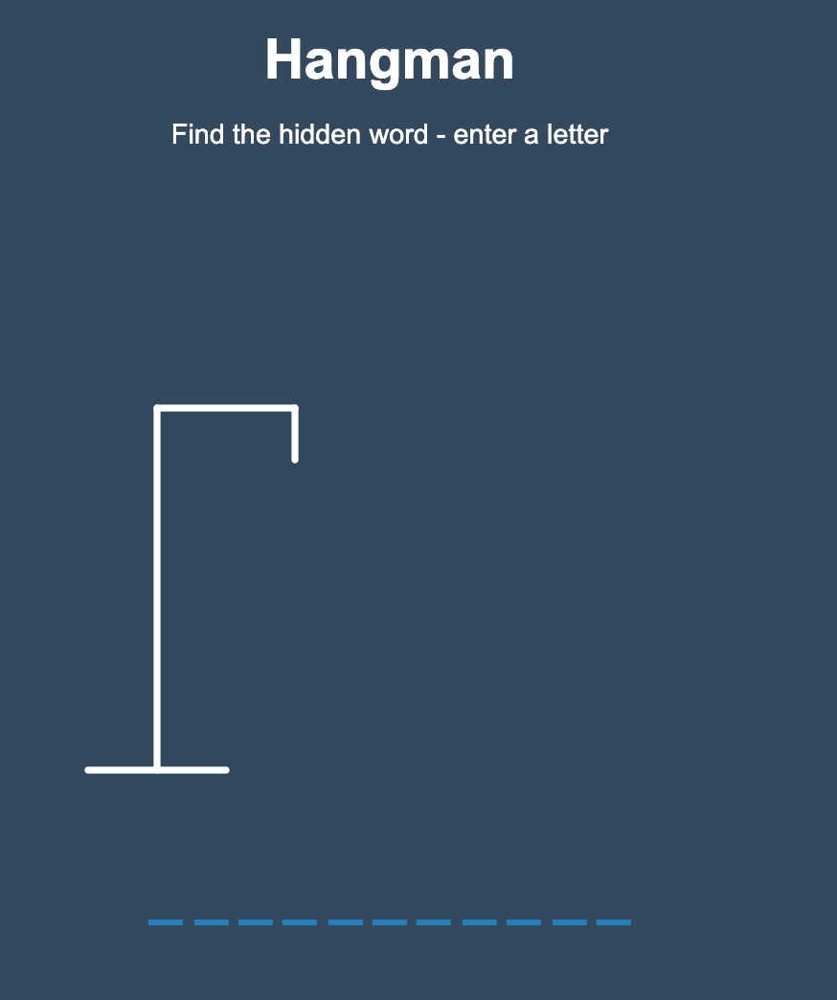
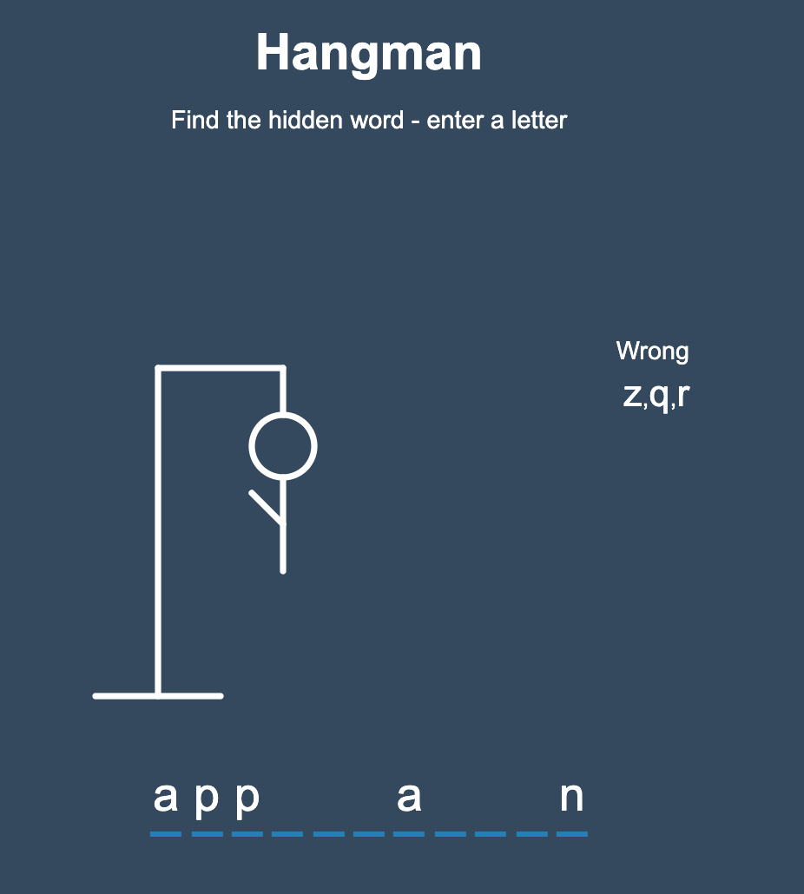
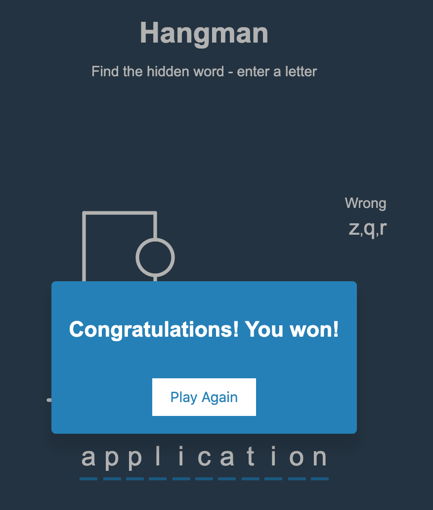
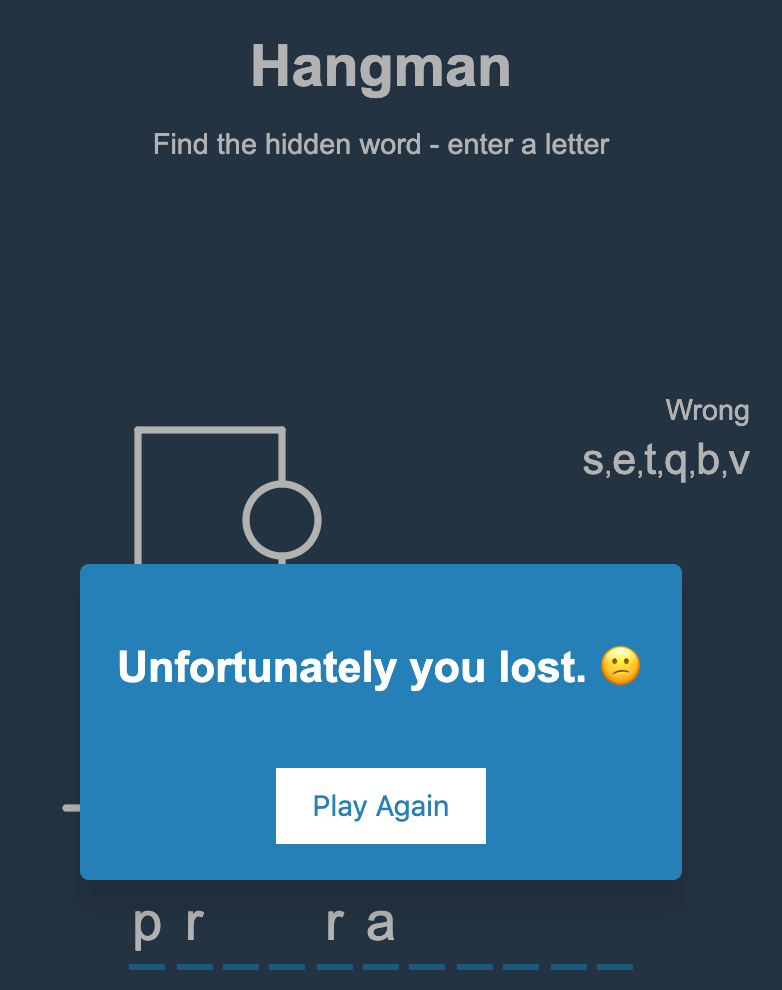

# Hangman

This project follows along with the [20 Web Projects With Vanilla JavaScript](https://www.udemy.com/course/web-projects-with-vanilla-javascript/) tutorials by Brad Traversy.

This project allows the player to play the word-guessing game, Hangman. The player guesses the hidden word by selecting letters, one at a time. If the player guesses a letter that is not a part of the current word in play, the wrong letter will show up in a "wrong letters" container. With every wrong letter chosen, a part of the body will appear on the hangman. If the player completes the word correctly before the hangman is completed, a popup will tell the player they have won. If the player is unable to complete the word correctly before the hangman is displayed, a popup will tell the player they have lost. Once the game is over, the player can start a new game.

CSS, JavaScript and HTML are used.

